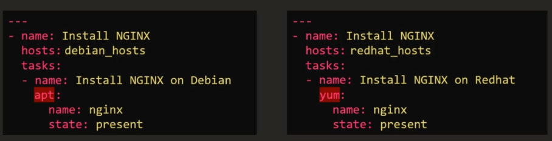

<!-- 2021-01-24 14:06:31 -->

# 8 - Variables, Conditionals, and Loops #
______________________________________________________________    

<p align=center>
    
</p>

Similar with any programming language, variables are used to store information varies with each host. Recall on the notes for [inventory files](1-Ansible_Inventory_YAML.md), we already worked with variables.

<p align=center>
    
</p>

We can configure variables in the playbook itself using the **vars** keyword, followed by the key-pairs. Below we have [add-2.yaml](add-2.yaml) which adds a thrid server to the /ansible-test/sample-file.txt in server1

```yaml
-
    name: Add servers to /ansible-test/sample-file.txt on server1
    hosts: server1
    vars:
      anotherserver: 10.0.0.127
    tasks:
        -
            name: Add another server to /ansible-test/sample-file.txt
            lineinfile: 
                path: ~/ansible-test/sample-file.txt
                line: 'server {{anotherserver}}'
```

Checking the */ansible-test/sample-file.txt* in server1 again, you should now see a third server:

```bash
eden@server1 ansible-test$ cat sample-file.txt 
server 10.0.0.125
server 10.0.0.126
server 10.0.0.127
```
_______________________________________________

Variables can also be created on a separate file and this separate file can just be referenced by the playbook. This will be further discussed on the section for **host_vars** and **group_vars**.
_________________________________________________

## CONDITIONALS ##


Here we have two playbooks that does the same thing but on different OS - install NGINX. Both install packages differently Debian distros use *apt* while RedHat uses *yum*.

Beside the package manager, you'll also have to specify different *hosts* for each one. Having two playbooks is alright but it can be done altogether using just one. This is where **conditionals** comes into play.

<p align=center>
    
</p>

We can do a single playbook with two tasks and then we specify the conditions under each task.

```yaml
-
    name: Install NGINX on Linux machines
    hosts: all
    tasks:
        -
            name: Install NGINX on Debian
            apt:
                name: nginx
                state: present
            when: ansible_os_family == "Debian" and
                  ansible_distribution_version == "18.04"
        -       
            name:
            yum:
                name: nginx
                state: present
            when: ansible_os_family == "RedHat" or
                  ansible_os_family == "SUSE"
```

Notice that for the **conditional statements**, we use the keyword **when**. We also use logical operators **and**, **or**, and the **'=='**. In addition to this, we also specify that **apt** is to be used for the first task while **yum** on the second one.

We use the **and** operator to tell Ansible to make sure both specified conditions are fulfilled. In this case, nginx will only be installed if the OS is Debian *and* the version on that machine is 18.04.

```yaml
            when: ansible_os_family == "Debian" and
                  ansible_distribution_version == "18.04"
```
On the other hand, we use **or** if atleast one of the conditions is required to be true, and not both.

```yaml
            when: ansible_os_family == "RedHat" or
                  ansible_os_family == "SUSE"
```   

<br>

**CONDITIONALS IN LOOPS**
We can also use conditions on loops. For the example below, we will be installign different services on a Debian machine. We can set the packages as a variable.

```yaml
-
    name: Install services
    hosts: all
    vars:
        packages:
            -
                name: nginx
                required: true
            -
                name: mysql
                required: true
            -
                name: apache
                required: false
    task:
        -
            name: Install "{{ item.name }}" on Debian
            apt:
                name: {{ item.name }}
                state: present
            when: item.required == true
            loop: "{{ packages }}"
```
The way I understood this is by reading the YAML from bottom to top. The first point we have here is we are **looping or iterating over the packages**.
```yaml
            loop: "{{ packages }}"
```
The packages referred in this instance is a variable which contain a set of packages along with an attribute *required* - basically the packages is a **list**. So we are simply **iterating over the list** and each package on that list is an **item**
```yaml
    vars:
        packages:
            -
                name: nginx
                required: true
            -
                name: mysql
                required: true
            -
                name: apache
                required: false
```
Now it goes over the first item, which is an nginx. It check if the attribute **required** is set to true, in which case, it will proceed with the task and install nginx using yum. Otherwise, it won't do anything. It repeats the process onto the second item, the third item, until it reaches the end of the list.
```yaml
    task:
        -
            name: Install "{{ item.name }}" on Debian
            apt:
                name: {{ item.name }}
                state: present
            when: item.required == true
```

<br>

**CONDITIONALS AND REGISTER**
We can also based the conditions on the output of the previous task. We can save the output or returned value of the preceeding task, and use that as basis of the condition. To store the output of the previous task, we use the **register** followed by the variable we want to use.

In the example below, we have a playbook which checks the status of httpd. If the service went down, it shoudl send an email.

```yaml
-
    name: Check status of httpd service and send email if down.
    hosts: server1
    tasks:
        -   
            name: Check status of httpd
            command: service httpd status
            register: status_var
        -
            name: Send email if down
            mail:
                to: admin@corp.com
                subject: Service Alert
                body: Hi, HTTPD service is down.
                when: status_var.stdout.find('down') != -1
```

The first task is first executed. It will run the *service httpd status* command on ht e linux machine and the output will be stored in the variable **status-var** which will be used in the second task.

```yaml
        -   
            name: Check status of httpd
            command: service httpd status
            register: status_var
```

Now for the second task, we try to read this from the bottom again. The condition here is to check the variable **status_var** and **find** for the word **"down"**. If the word in not found in the variable, it wll return a value of **-1**.
Otherwise, the value will not be **-1** and it will proceed with the task of sending the email.

```yaml
        -
            name: Send email if down
            mail:
                to: admin@corp.com
                subject: Service Alert
                body: Hi, HTTPD service is down.
                when: status_var.stdout.find('down') != -1
```
<br>

<sup>*EDEN: This one is still a bit fuzzy to me. Although I get the explanation on the video, i would need to see other examples in the internet*</sup>

_____________________________________________________

## LOOPS ##

In the [create-user.yaml](create-user.yaml) below, we'll be using the **user module** to create users on the target machines. As you can see, this is not efficient since we have multiple tasks that just does the same thing.

```yaml
-
    name: Create users
    hosts: server1
    tasks:
        -
            user: name=john state=present
        -
            user: name=jane state=present
        -
            user: name=jeff state=present
        -
            user: name=sam state=present
        -
            user: name=ron state=present
        -
            user: name=mack state=present
```
So we modified the [create-user.yaml](create-user.yaml) to include just one task and **loop over the list** of users.

```yaml
-
    name: Create users
    hosts: server1
    tasks:
        -
            user: name="{{ item }}" state=present
            loop:
                - john
                - jane
                - jeff
                - sam
                - ron
                - mack
```
Now let's say we want to create a user and a corresponding user ID. This would mean we have to loop over a set of *key-pair* values. For this one, we can use **dictionaries**. We have created a second playbook below, [create-user-id.yaml](create-user-id.yaml) which does exactly that.

```yaml
-
    name: Create user with corresponding user ID
    hosts: server1
    tasks:
        - 
            user:
                name: "{{ item.name }}"
                uid: "{{ item.uid }}"
                state: present
            loop:
                - 
                    name: john
                    uid: 1000
                - 
                    name: jane
                    uid: 1001
                -
                    name: jeff
                    uid: 1002
                - 
                    name: sam
                    uid: 1003
                - 
                    name: ron
                    uid: 1004
                -
                    name: mack
                    uid: 1005
```
IN another example, [create-user-id-with.yaml](create-user-id-with.yaml), we see another way to write loops using **with_items**.

```yaml
-
    name:
    hosts:
    tasks:
        -
            user: 
                name: "{{ item.name }}"
                uid: "{{ item.uid }}"
                state: present
            with_items:
                - john
                - jane
                - jeff
                - sam
                - ron
                - mack
```

The **with_** can also be useful in other instances, like handling files, working on a set of URLs, or connecting to multiple database.

Note that each one used their own keyword. There are a lot more of these, but below  are just some example.
- with_files
- with_url
- with_mongodb

<p align=center>
    
</p>

_______________________________________________