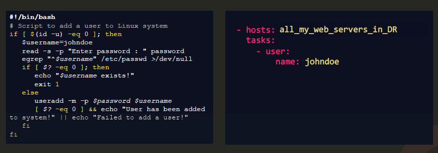
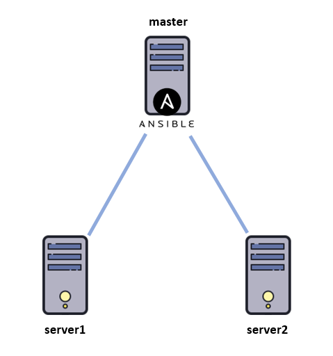
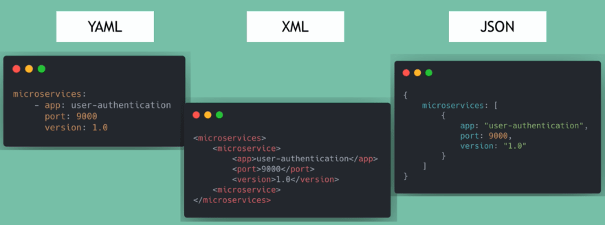

<!-- 2021-01-22 23:16:34 -->

# 1 - Ansible, Inventory, and YAML #
____________________________________

This note talks about:
- What is Ansible
- Setting up your Lab and Installing Ansible
- Inventory file
- What is YAML
____________________________________

<br><br>
<p align=center>
    
</p>
<br><br>

To do some repetitive tasks, we can resolve to using *scripts* to do these tasks for us. However, you will some coding skills to do this. You'll also have to maintain this scripts over time. This is where Ansible comes into play.

**Ansible** is a radically simple IT automation platform that makes easier deployments. The main features of Ansible includes:
- simple
- powerful
- agentless

A typical comparison of scripts versus an ansible playbook:

<p align=center>
    
</p>

___________________________________________________

## SETUP AND INSTALL ANSIBLE ##

*EDEN: In the course, the instructor is using VirtualBox to run the VMs. I chose to leverage AWS and spin up 3 EC2 Instances (CentOS). You can choose to run VMs in VirtualBox or VMware Workstation, or you can also spin instances in the cloud*

<p align=center>
    
</p>

The steps I followed in setting up the EC2 instances and installing ansible on **master** are:

1.  I first created a VPC, a subnet, route table, and internet gateway where I'll be putting my instances. Also created a Security Group allowing SSH Access only from my IP address. This will be used by the instances. 
<br>Yeah, it's more work, but it's a way to practice AWS as well.
If you're using VirtualBox or VMware Workstation, please skip to Step 4.
    
    <br>

2.  Launch three CentOS instances from the AWS Marketplace. The AMI ID of the CentOS images I used is **ami-0adfdaea54d40922b**. <br>
You can check out the other available CentOS images
in their [wiki](https://wiki.centos.org/Cloud/AWS).

<br>

3.  In the *Step 3-Configure Instance*, you can setup the user data to include the script below. This just changes the default username on each instance to your preferred username. You can read more about it [here.](https://askubuntu.com/questions/261824/how-to-change-the-default-user-name-from-ubuntu-to-something-else-on-ec2-ami) 
<br>

    The purpose of this is to have the same user account with sudo privileges across all your linux machines. Ansible will use same username when logging in to ther **server** machines.

        #cloud-config
        system_info:
            default_user:
                name: <change to your preferred username>

    **NOTE**: If you're using Virtualbox or VMware Workstation, configure the same username with sudo privileges in all your linux machines by issuing:

        useradd -m -G root <new-username>

&nbsp;&nbsp;&nbsp;&nbsp;&nbsp;&nbsp;&nbsp;<sub>*EDEN: Do not forget to attach IGW to VPC. Routing won't work if there's no IGW on the VPC.*</sub>

<br>

4.  When all the three instances are now in *running* state, SSH into each one and make sure they can ping one another's private IP address. Set also your default user password on each instance.

        passwd <user-name>
        # Set new password when prompted.

<br>

5.  Rename the hostnames according to the diagram above. You can use the commands below. You can now see the new hostnames when you try to connect again.

        sudo hostnamectl set-hostname <new-hostname>
        sudo sed -i "s/localhost/localhost <new-hostname>/" /etc/hosts
        sudo reboot

    If you're using a different Linux distro, I've included another [resource](installing-gui-change-hostname.txt) which you can check out.

<br>

6.  On the **master**, add the ip and hostnames of the **server** machines to the */etc/hosts* file. Do the same for **server1** and **server2**.

    ```bash
    [eden@master ~]$ sudo vi /etc/hosts
    127.0.0.1   localhost master
    ::1         localhost master
    10.0.0.246  server1
    10.0.0.161  server2

    [eden@server1 ~]$ sudo vi /etc/hosts
    127.0.0.1   localhost server1
    ::1         localhost server1
    10.0.0.136  master
    10.0.0.161  server2

    [eden@server2 ~]$ sudo vi /etc/hosts
    127.0.0.1   localhost server2
    ::1         localhost server2
    10.0.0.136  master
    10.0.0.246  server1
    ```

7.  You can disable the checking of host-key on the **server** machines so that they won't require ansible to enter a password everytime ansible connects to them by using the command below, but note that **THIS IS NOT RECOMMENDED**

        sed -i "s/#host_key_checking/host_key_checking/" /etc/ansible/ansible.cfg

<br>

8.  A better way to ensure that the **master** can log in to both **server** machines without entering a password is to generate an SSH key in the **master** and copy it to the **server** machines.

        # this is done in the master
        ssh-keygen
        ssh-copy-id -i .ssh/id_rsa.pub server1
        ssh-copy-id -i .ssh/id_rsa.pub server2

    If you encountered an this error: 
    **Permission denied (publickey,gssapi-keyex,gssapi-with-mic),** 
    you might need to modify the /etc/ssh/sshd_config in both the **server** machines.

        # This is done on both server 1 and server2
        # Verify that PasswordAuth is set to no
        sudo grep PasswordAuth /etc/ssh/sshd_config

        # Change to yes
        sudo sed -i "s/PasswordAuthentication no/PasswordAuthentication yes/" /etc/ssh/sshd_config

        # Check again to make sure it is changed.
        sudo grep PasswordAuth /etc/ssh/sshd_config

        # Reboot sshd
        sudo systemctl restart sshd
    
    Here's a [link](https://superuser.com/questions/890128/ssh-copy-id-public-key-denied) which you can check out. You might also want to read this [one](https://www.digitalocean.com/community/questions/ssh-copy-id-not-working-permission-denied-publickey).
    <br>

9.  Install Ansible on the **master** machine by running:

        sudo yum install  -y ansible
    
    If you get this error: **No package ansible available. Error: Nothing to do**, you might need to install the **epel-release** first.

        sudo yum install -y epel-release

    You can also install ansible using *pip*:
        
        # install pip if it's not present
        sudo yum install -y epel-release
        sudo yum install -y pip

        # Install ansible
        sudo pip install -y ansible

        # Install specific version of ansible
        sudo pip install -y ansible==2.4

        # Upgrade ansible using pip
        sudo pip install --upgrade -y ansible

         
    You can check out the [Ansible documentation](https://docs.ansible.com/ansible/latest/installation_guide/intro_installation.html) for more details on installing Ansible on other operating systems.

    <br>

10. Lastly, verify Ansible is installed and running.

        ansible --version

    You can also use the ping module to ping localhost

    ```yaml
    eden@master ~$ ansible localhost -m ping
    localhost | SUCCESS => {
        "changed": false, 
        "ping": "pong"
    }
    ```
    <br>

11. (OPTIONAL) This part is optional is you already have **python** and **nano**. Personally I prefer to have both nano and vi readily available in my Linux machines. There are some instances where I can edit a file faster using nano. but there's also instances where shortcuts in vi become more useful.

    <br>

    To install python and test afterwards:

            sudo yum install -y python
            
            # See what version is installed
            python -V
            python --version

    To install nano editor:

            sudo yum install -y nano
________________________________________________

## INVENTORY ##

<p align=center>
    
</p>
Recall that Ansible is **agentless** - this means you don't have to install any additional software on the target machines to work with Ansible.


The information about these target machines are stored in an **inventory file**. If you don't create a new inventory file, Ansible will use the default **/etc/ansible/hosts** file. 

You're /etc/ansible/hosts file could look like this:

    # You can set up aliases by using the "ansible_host" parameter.
    
    mail1   ansible_host=server1.company.com
    mail2   ansible_host=server2.company.com
    db1     ansible_host=server3.company.com
    db2     ansible_host=server4.company.com
    
    # You can also group the target machines
    
    [mailservers]
    mail1
    mail2

    [dbservers]
    db1
    db2

    # You can also nest groups by using ':children'
    
    [linuxservers:children]
    mail
    db

The **ansible_host** is an invetory parameter which you can use to specify the FQDN or IP address of the server. 

Other ansible parameters we can use are:

**ansible_connection** - ssh/winrm/localhost
This defines how ansible will connect to the target server. 

    mail1   ansible_host=server1.company.com    ansible_connection=ssh
    mail2   ansible_host=server2.company.com    ansible_connection=winrm
    db1     ansible_connection=ssh
    db2     ansible_connection=winrm

You can also set it to localhost to indicate that you're working on a local host and not a remote host.

    localhost ansible_connection=localhost
<br>

**ansible_port** - 22/5986
This defines which port to connect to. It is set to 22 for SSH by default but you can change it to other port numbers.

    mail1   ansible_port=25

<br>

**ansible_user** - root/administrator
Defines the user making the remote connections. This is set to root by default on Linux machines but you can change it to any other user.

    web     ansible_user=root
    mail    ansible_user=admin
<br>

**ansible_ssh_pass** - password
Can be used to define the passwords for Linux. Note that storing passwords in plain-text is not a good practice.

    web     ansible_ssh_pass=adMin123

The best way is to set password-less, ssh-key-based authentication on your servers.
_________________

As practice, you can begin by connecting to the **master** machine. We will first update the default **/etc/ansible/hosts** file to include the **server** machines at the bottom. Open the **hosts** file with vi or nano then add our **server** machines

    127.0.0.1   localhost
    server1
    server2

We will first create a directory called **ansible-lab** which will contain all our files. Then we will create another **inventory.txt** where we will group the **server** machines.

    ```bash
    eden@master ~$ mkdir ansible-lab
    eden@master ~$ cd ansible-lab/
    eden@master ansible-lab$ sudo nano inventory.txt

    server1
    server2

    [linuxservers]
    server1
    server2
    ```
Currently, we have two inventory files where Ansible can go to check the target machines. We can test this my running the ping module against the hosts using the '-m' flag.

```bash
# This pings all the hosts specified in the default inventory file.
ansible -m ping server1
ansible -m ping server2
ansible -m ping all

# This pings the linuxservers group. 
# Note that this will fail because it is checking the default hosts file.
ansible -m ping linuxservers

# This tells ansible to use the custom inventory file.
# This will now succeed.
ansible -m ping linuxservers -i inventory.txt
```

Output:

```bash
eden@master ansible-lab$ ansible -m ping server1
server1 | SUCCESS => {
    "ansible_facts": {
        "discovered_interpreter_python": "/usr/bin/python"    }, 
    "changed": false, 
    "ping": "pong"
}
eden@master ansible-lab$ ansible -m ping server2
server2 | SUCCESS => {
    "ansible_facts": {
        "discovered_interpreter_python": "/usr/bin/python"    }, 
    "changed": false, 
    "ping": "pong"
}
eden@master ansible-lab$ ansible -m ping all
server1 | SUCCESS => {
    "ansible_facts": {
        "discovered_interpreter_python": "/usr/bin/python"    }, 
    "changed": false, 
    "ping": "pong"
}
server2 | SUCCESS => {
    "ansible_facts": {
        "discovered_interpreter_python": "/usr/bin/python"    }, 
    "changed": false, 
    "ping": "pong"
}
eden@master ansible-lab$ ansible -m ping linuxservers
[WARNING]: Could not match supplied host pattern, ignoring: linuxservers
[WARNING]: No hosts matched, nothing to do
```

Notice that when we try to ping the group **linuxservers**, it failed. The group is not defined in the default /etc/ansible/hosts file which Ansible is checking. We only defined it in the inventory.txt.

Now if we tell Ansible to use the custom **inventory.txt** using the -i flag, the ping will now succeed.

```bash
eden@master ansible-lab$ ansible -m ping linuxservers -i inventory.txt
server1 | SUCCESS => {
    "ansible_facts": {
        "discovered_interpreter_python": "/usr/bin/python"    }, 
    "changed": false, 
    "ping": "pong"
}
server2 | SUCCESS => {
    "ansible_facts": {
        "discovered_interpreter_python": "/usr/bin/python"    }, 
    "changed": false, 
    "ping": "pong"
}

eden@master ansible-lab$ pwd
/home/eden/ansible-lab
```
**NOTE:** Make sure that you're on the same directory as the custom inventory file when you specify the -i flag and the inventory file.
________________________________________________

## WHAT IS YAML? ##

<p align=center>
    
</p>

All ansible playbooks are written in **YAML**. But before that, what are ansible playbooks?

**Ansible Playbooks** are plain-text files written in YAML, which stands for *YAML Ain't Markup Lanugage.* It is used to represent data. Here is a comparison of the same data in three formats: YAML, XML, and JSON.

<p align=center>
    
</p>

In it's simplest form, YAML are just **key-value pairs**. Anything that begins with a *hash* is a comment and is then ignored when YAML is run.


    # These are the Key: Value
    Fruit: Apple
    Fish: Salmon
    Meat: Chicken
    Liquid: Water
    Flavored: Soda
    Hot drink: Coffee

We can also arrange them in **arrays**, which is similar to **lists**. Here you should take note of the space after the dash "-".

    Edible:
    - Apple
    - Salmon
    - Chicken

    Beverages:
    - Water
    - Soda
    - Coffee

We can also set the values in **maps**, which is similar to **dictionaries**. Here you should take note of the indentation which indicates that the indented pairings are attributes of the non-indented value.

    Apple:
        Calories: 105
        Fat: 0.4 g
        Carbs: 27 g

    Salmon:
        Calories: 62
        Fat: 0.3 g 
        Cabs: 16 g

We can have nested dictionaries.

        Fruits: Apple
        Nutrition:
            Calories: 105
            Fat: 0.4 g
            Carbs: 27 g

        Fish: Salmon
        Nutrition:
            Calories: 62
            Fat: 0.3 g 
            Cabs: 16 g

We can also next the key-value, dictionary, and lists altogether.

    Edibles:

        - Apple:
            Calories: 105
            Fat: 0.4 g
            Carbs: 27 g

        - Salmon:
            Calories: 62
            Fat: 0.3 g 
            Cabs: 16 g
<br>

**So what's the difference between lists and dictionaries?**

Lists are ordered - this means each item has a specific index and you can access that item be indicating their index.

    # List A is not equal with List B

    List_A:                 List_B:             
    - Chicken               - Chicken
    - Carrots               - Fish
    - Apple                 - Apple
    - Fish                  - Carrots

On the other hand, order is not important in dictionaries as you can access values through their keys.

    # Dict_A is equal to Dict_B

    Dict_A:                 Dict_B:
        color: black            brand: aston martin
        year: 2020              color: red
        model: vantage          year: 2020
        brand: aston martin     model: vantage

__________________________________________________        
