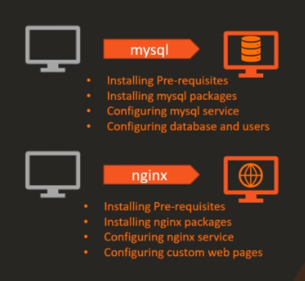
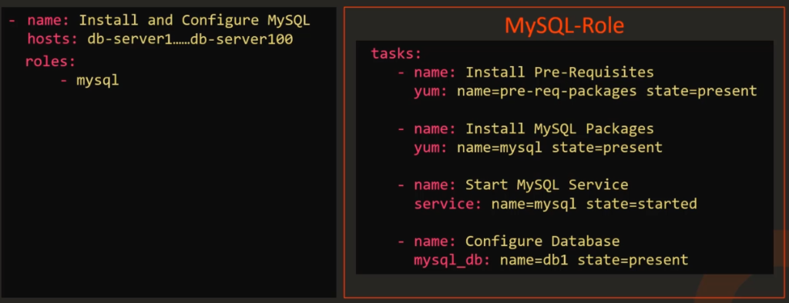
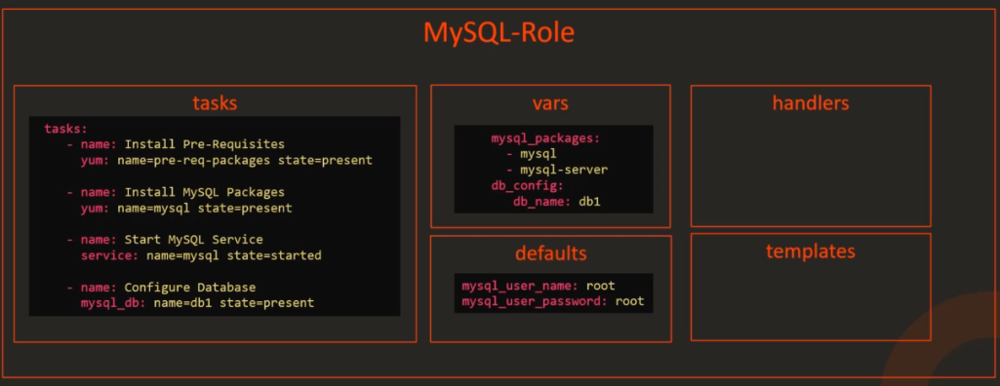
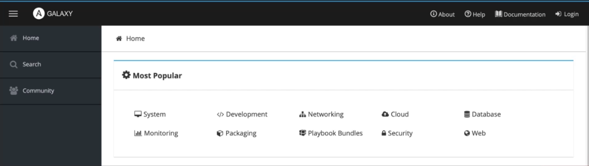
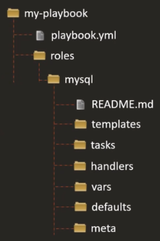
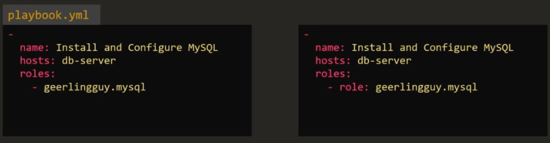
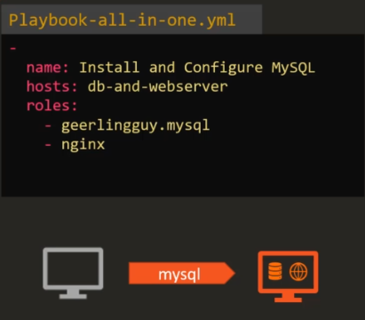
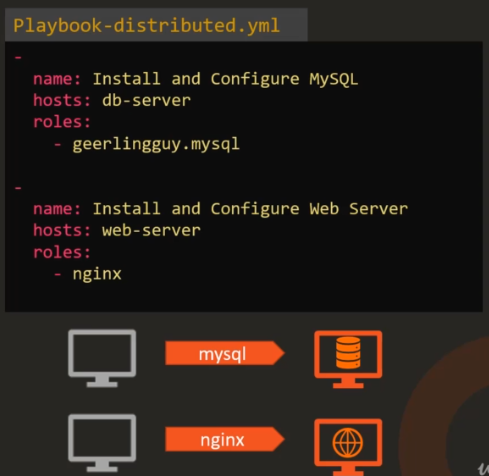

<!-- 2021-01-25 00:02:46 -->

# 10 - Ansible Roles #
______________________________________________________________    

<p align=center>
    
</p>

In the automation world, assigning a role means designating a 'hat' to the particular server or device and that device will do what it needs to do to fulfill its role.

<p align=center>
    
</p>

But all of these can be done and written in a playbook. So why would you need roles then?

**REUSABILITY**
Recall that when an ansible-playbook is written, it can be used, copied, and run by those who have access to it. instead of having other use the same code from the same playbook, you can just assign this playbook to a role and then other people can just reference it as **role**.

<p align=center>
    
</p>

**ORGANIZING CODE**
Roles also help in organizing your code within Ansible.

<p align=center>
    
</p>

**SHARING WITH THE COMMUNITY**
*Ansible Galaxy* is a community where you can find a wide number of roles for almost every task you need.
<p align=center>
    
</p>

__________________________________________

## HOW TO START WITH ROLES? ##

**METHOD 1 - Creating a roles folder**
From the directory where you are have all your playbooks stored, create a folder for **roles.** You will then intialize a diretory structure within that **roles** folder using the command **ansible-galaxy init *role-name***

<p align=center>
    
</p> 

For our example, we'll create role called **mysql**. 

    ansible-galaxy init mysql

Let's assume for now that you have set up all the needed folders under roles and all that' left to do is to initialize it and reference it in a playbook.

You can now reference the new role in your playbook.

```yaml
-
    name: Install and COnfigure MySQL
    hosts: db-server
    rolse:
        - mysql
```
<br>

**METHOD2 - Putting the role under the default /etc/ansible/roles**
Another way to move the roles into a common directory designated for roles on your system. This is the **/etc/ansible/roles**. This is where Ansible will search for roles by default if it cannot find a roles folder in your Ansible directory.

You cna further modify the default role directory by changing the **role_path** defined in **/etc/ansible/ansible.cfg**.

```bash
$ grep roles_path /etc/ansible/ansible.cfg
roles_path = /etc/ansible/roles
```
<br>

___________________________________________

## SEARCHING ROLES IN ANSIBLE GALAXY ##

You can search for specific roles needed for your task in the Ansible Galaxy UI when you go to their [site](https://galaxy.ansible.com/) or you can search throguh the command line.

```bash
ansible-galaxy search mysql
```

Once you found a role that fits your need, you can install by running the command below. It will then be extracted to the default Ansible role directory at /etc/ansible/roles

```bash
ansible-galaxy install sample.mysql
```

After you've installed the role, you can reference the role in either of this approach:

<p align=center>
    
</p>

Another example is when you want your server to have two services running on it. In this case, you can assign two roles to it.

<p align=center>
    
</p>

To view two completely different roles on two separate servers, you can put them as two plays in a single playbook.

<p align=center>
    
</p>

To see all the roles currently installed in your machine, run the command:

    ansible-galaxy list

To view where the roles would be installed, run this command. The **DEFAULT_ROLES_PATH** is where the roles will be installed.

    ansible-config dump | grep ROLE

You cna also install roles in the current directory by using the -p flag

    ansible-galaxy install sample.mysql -p ./roles

_______________________________________________________