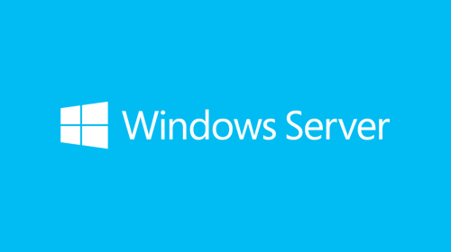

<!-- 2021-01-25 00:02:46 -->

# 11 - Advanced Topics #
______________________________________________________________    

<p align=center>
    
</p>

These are just a brief breakdown on topics you can check out for Ansible. There are also no labs here, you can further explore the areas that interest you.

You can check out more details in the [Ansible Documentation page](https://docs.ansible.com/)

- Windows Server
- Ansible-Galaxy
- Patterns
- Dynamic Inventory
- Developing Custom Modules

_______________________________________________________________

## PREPARING A WINDOWS ENVIRONMENT ##

Recall that the **Ansible Controller** can only be run on Linux. However, Windows machines can be used as target machines, thus they can be part of automation.

<p align=center>
    
</p>

For Ansible to connect to a Windows machine, we should use **winrm**. This may not always be enable by default in Windows machines. You may follow the following steps to setup winrm on the Windows machines.

Remember that Ansible is *agentless*, so you won't need to install anything from Ansible on the Windows machine.

1.  Install the **pywinrm** module on the Ansible controller by running:

        sudo pip install "pywinrm>=0.2.2"

2. Next is to install winrm on the Windows Server. You can use the powershell script provided by Ansible. See more details about setting up a Windows Host [here](https://docs.ansible.com/ansible/2.5/user_guide/windows_setup.html)

        example/scripts/**ConfigureRemotingForAnsible.ps1**

3.  There are different modes of authentication that you can also set up:

    - Basic
    - Certificate-based
    - Kerberos
    - NTLP
    - CredSSP

______________________________________________________________

## ANSIBLE GALAXY ##

This is a free site for sharing all kinds of comuunity-develoepd Ansible roles. This is a great way to start on your automation projects. You can visit theit site [here.](https://galaxy.ansible.com/)

<p align=center>
    
</p>

______________________________________________________________

## PATTERNS ##

AN example of this is specifying the **hosts**. We can specify one hosts a time, or we can also specify multiple hosts and groups by separating them with a comma (,).

```yaml
-
    name: Example Play
    hosts: host1, host2, group1
```
We can also use wildcard patterns. Here we can run the playbook on all hosts that start with "server" and hosts that ends with ".company.com"

```yaml
-
    name: Example Play 2
    hosts: server*, *.company.com
```
You can find out more about patterns in the [Ansible documentation page](https://docs.ansible.com/ansible/latest/user_guide/intro_patterns.html)

______________________________________________________________

## DYNAMIC INVENTORY ##

Recall that we can define all or hosts in the default inventory filem */etc/ansible/hosts*. We can also create a custom inventory file. When you run the playbook, you'll also need to specify the inventory file.

    ansible-playbook sample.yaml -i inventory.txt

Both of these are good but these are **static** methods and you'll have to change them manually. If you'll have to integrate Ansible with other sources in your environment, you will need to make this inventory dynamic. 

To do this, you can create a script and specify it when you run the playbook:

    ansible-playbook sample.yaml -i inventory.py

This script will be responsible of getting information from the sources in your environments and providing Ansible with the details.

______________________________________________________________

## DEVELOPING CUSTOM MODULES ##

Modules are simple pre-built python scripts that perform specific actions. If you can't find a moduel that satisfy your requirement, you cand develop your own custom module.

To do this you just jave to write your own python program and place it on the modules directory on your server. Note that the program has to follow a **certain format**. You can get at the [Ansible documentation page](https://docs.ansible.com/ansible/latest/dev_guide/developing_modules_general.html).

______________________________________________________________
