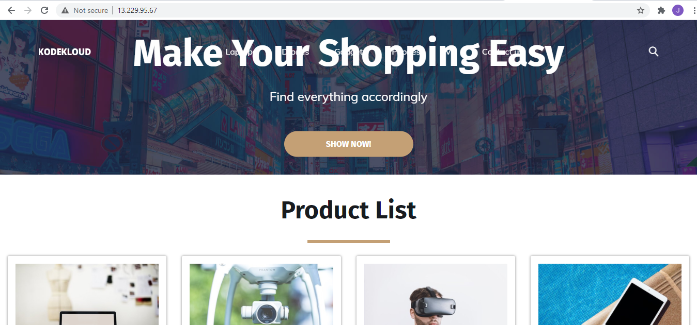

<!-- 2021-01-25 09:31:09 -->

# 12 - Final Project #
______________________________________________________________  

For the final project, we'll be using the **LAMP** stack application to deploy our own fictional KodeKloud e-commerce website that sells electronic devices. But for this one, we'll be using *MariaDB* in place of MySQL.

    L - Linux
    A - Apache
    M - MariaDB
    P - PHP

Note that this won't be using Ansible to automate the deployment. We will just work on a single-node deployment of this application.

Before starting off, it's good to always know what you're automating - what are the different components in the application and how they all work together without automation vs. how they should work together when there's automation.

1.  Identify the system to deploy our application. This will be **CentOS Linux.** This includes installing the **firewall**.
<br>

2.  Install and configure **Apache HTTPD server**

    - Install and configure HTTPD
    - Configure firewalld
    - Enable and start HTTPD
<br>

3.  Install and configure the database.

    - Install MariaDB
    - Configure MariaDB
    - Start MariaDB
    - Configure Firewall
    - Configure Database
    - Load data
<br>

4.  install and configure PHP on the server.

    - Install PHP
    - Configure code
    - Test
<br>

5.  Ensure we have all system requirements configured correctly.

    - Install and configure firewalls in our server
    - Configure necessary roles to enable communication between the components.

Now that we have identified the important steps to take, we can further arrange these tasks to simplify the flow:

```bash

1.  Install firewall on CentOS
2.  Install and configure MariaDB
3.  Enable and Start MariaDB
4.  Configure Firewall
5.  Configure Database
6.  Load data
7.  Install httpd
8.  Install PHP
9.  Configure Firewall
10. Configure httpd
11. Enable and start httpd
12. Download code
13. Test
```
______________________________________________________________  

(These steps can also be found in KodeKloud's repo for the [learning-app-commerce project](https://github.com/kodekloudhub/learning-app-ecommerce))

For this project, we'll just deploy a sample e-commerce website on a single CentOS Linux machine. Once I'm done with this, I might try to create a playbook whihc can automate the whole deployment.
______________________________________________________________  

1.  We'll first begin with installing the pre-requisite - firewalld. Once installed, we'll enable it so service will service will persist across reboots, start the service, and then verify that the status is active.

        sudo yum install -y firewalld
        sudo systemctl enable firewalld
        sudo systemctl status firewalld
    
    Another way to check if firewalld is running is to list all the current rules:

        firewall-cmd --list-all    
<br>

2.  Next up, we install the Mariadb-server. You can modify the /etc/my.cnf file if you want to make any changes to the default settings, e.g. mysql port. Enable and start the service.

        sudo yum install -y mariadb-server
        sudo systemctl enable mariadb
        sudo systemctl start mariadb
        sudo systemctl status mariadb
<br>

3.  Configure the firewall rule to allow access to the default MySQL Port=3306. For changes to reflect, you'll have to reload the firewalld afterwards

        sudo firewall-cmd --permanent --zone=public --add-port=3306/tcp
        sudo firewall-cmd --reload

    To check if the MySQL port is reflected, list the rules:

        $ sudo firewall-cmd --list-all
        public (active)
            target: default
            icmp-block-inversion: no
            interfaces: eth0
            sources:
            services: dhcpv6-client ssh
            ports: 3306/tcp 
            protocols:
            masquerade: no
            forward-ports:
            source-ports:
            icmp-blocks:
            rich rules:

    
<br>

4.  Configure database with the required username and privileges.
Type in *mysql* to start configuring. Type *exit* once you're done.

        $ mysql
        MariaDB > CREATE DATABASE ecomdb;
        MariaDB > CREATE USER 'ecomuser'@'localhost' IDENTIFIED BY 'ecompassword';
        MariaDB > GRANT ALL PRIVILEGES ON *.* TO 'ecomuser'@'localhost';
        MariaDB > FLUSH PRIVILEGES;

    To verify if the *ecomdb* database is create, run:

        show databases;
<br>

5.  Next is to load the sample data onto the database. These data will show up in the application once it's up and running. We have a sql script, [db-load-script.sql](db-load-script.sql) which will create a table called *products* and insert a set of random data.

        $ sudo nano db-load-script.sql
        USE ecomdb;
        CREATE TABLE products (id mediumint(8) unsigned NOT NULL auto_increment,Name varchar(255) default NULL,Price varchar(255) default NULL, ImageUrl varchar(255) default NULL,PRIMARY KEY (id)) AUTO_INCREMENT=1;

        INSERT INTO products (Name,Price,ImageUrl) VALUES ("Laptop","100","c-1.png"),("Drone","200","c-2.png"),("VR","300","c-3.png"),("Tablet","50","c-5.png"),("Watch","90","c-6.png"),("Phone Covers","20","c-7.png"),("Phone","80","c-8.png"),("Laptop","150","c-4.png");
<br>

6.  After you've created the SQL script in your linux machine, you can load the product inventory into your database by feeding it the SQL script.

        mysql < db-load-script.sql
<br>

7.  Login back to mysql and check if the database has been created and switch to the *ecomdb* user to see the prodcuts table.

        mysql
        show databases;
        use ecomdb;
        select * from products;
<br>

8.  once our database is all set up, we can now proceed to deploying and configuring our web application. We start with installing the required packages: **https, php**, and **php-mysql**

        sudo yum install -y httpd php php-mysql
<br>

9.  We configure the firewall to allow httpd port=80. Reload afterwards. 

        sudo firewall-cmd --permanent --zone=public --add-port=80/tcp
        sudo firewall-cmd --reload

    Check if the httpd port is reflected after reload.

        $ sudo firewall-cmd --list-all
        public (active)
            target: default
            icmp-block-inversion: no
            interfaces: eth0
            sources:
            services: dhcpv6-client ssh
            ports: 3306/tcp 80/tcp
            protocols:
            masquerade: no
            forward-ports:
            source-ports:
            icmp-blocks:
            rich rules:
<br>

10. Update the **DirectoryIndex** value to **index.php**. This is originally set to index.html which is the Apache test page. When you try to view your application by opening *http://<ip>:80* on your browser, it will show the index.html by default. To make sure that it points to our application, we'll have to point the **DirectoryIndex** to index.php.


        $ grep DirectoryIndex  /etc/httpd/conf/httpd.conf
        # DirectoryIndex: sets the file that Apache will serve if a directory
            DirectoryIndex index.html

    
    To change the value, use *sed* to replace it:

        sed -i "s/DirectoryIndex index.html/DirectoryIndex index.php/" /etc/httpd/conf/httpd.conf
<br>

11. Next step is to download our code for the application suing git. You may need to isntall git in your machine.

        sudo yum install -y git
        git clone https://github.com/kodekloudhub/learning-app-ecommerce.git /var/www/html/

    To check if the repo is cloned, go to /var/www/html.

        $ cd /var/www/html && ls
        assets  css  fonts  img  index.php  js  README.md  scss  vendors
<br>

12. Update the **mysql0_connect** in the index.php file with the ip address of your mysql database. Since our stup is a single node, this is the ip of your localhost or your linux machine.

        $ sudo vi index.php

            $link = mysqli_connect('localhost', 'ecomuser', 'ecompassword', 'ecomdb');
<br>

13. View your application by opening a browser and typing in:

        http://<ip-linux>:80

    You should see something like this:
    <br>

    <p align=center>
        
    </p>

______________________________________________________________  

